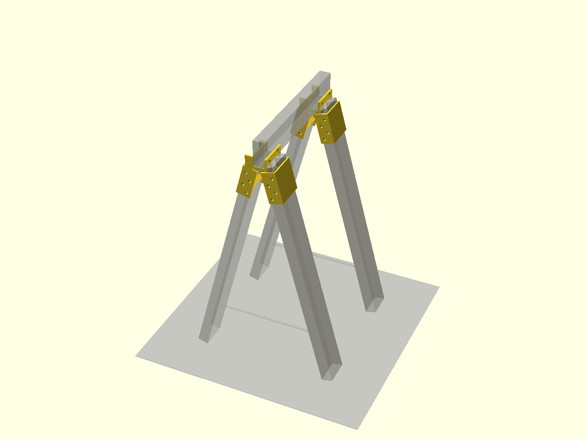
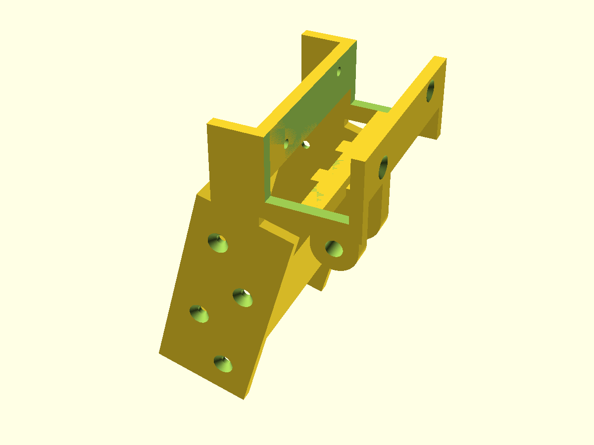
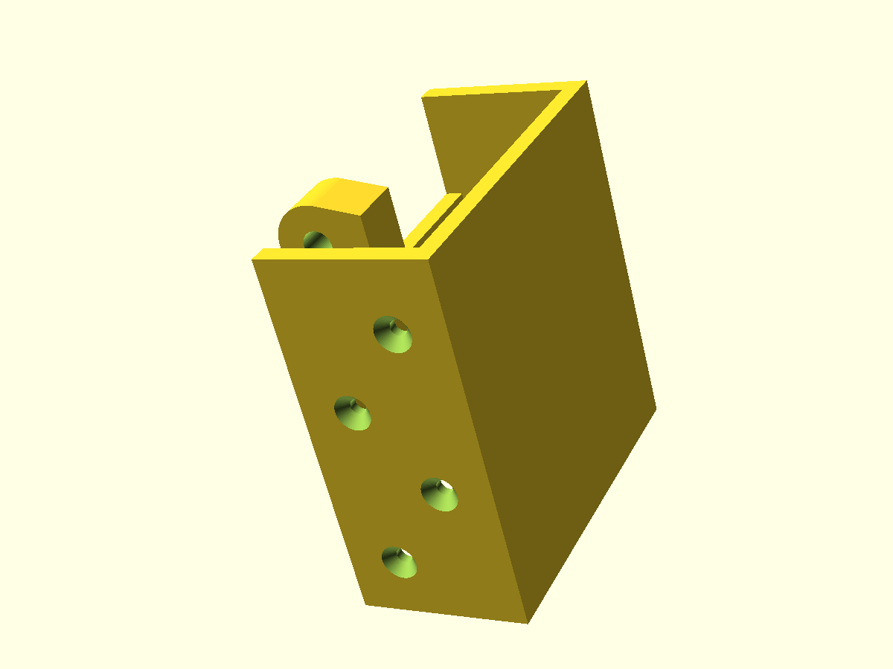
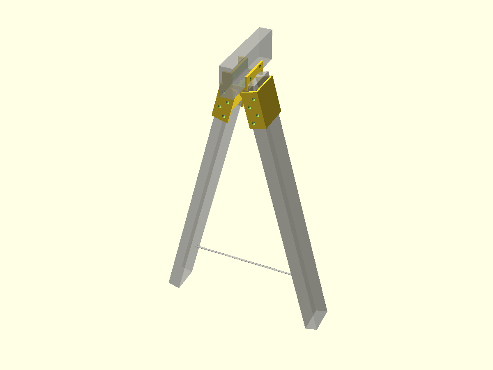
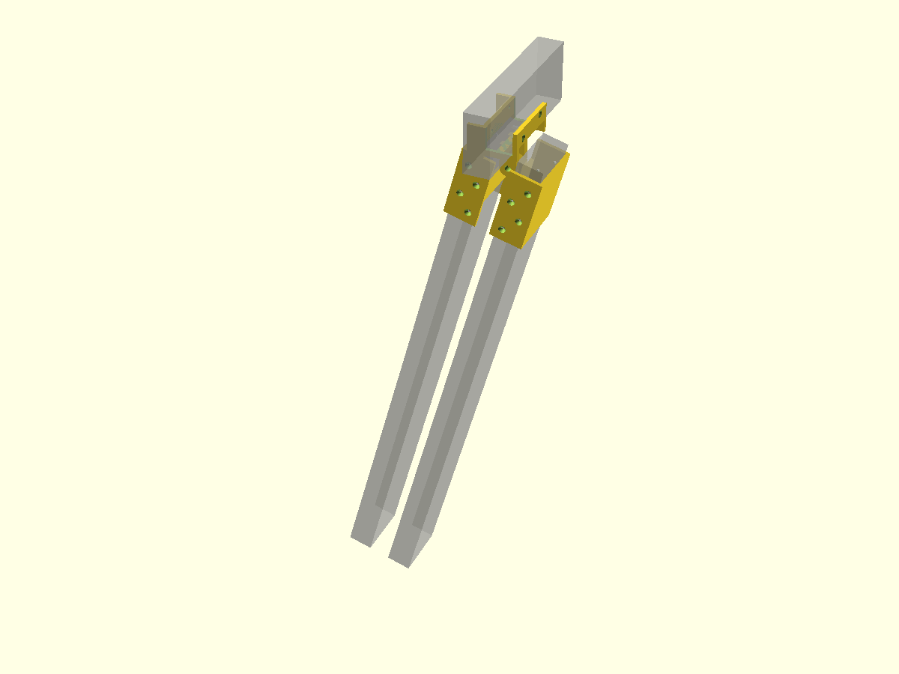
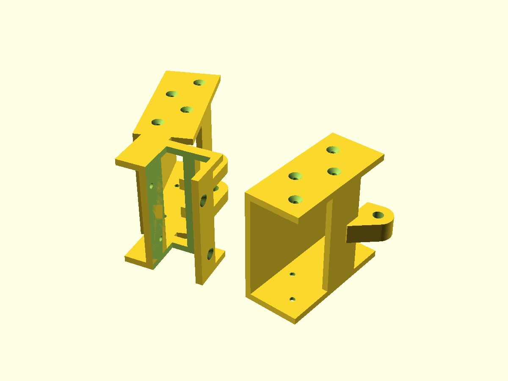

# Folding Saw Horse Bracket

Parametric OpenSCAD bracket that turns **straight cut 86 x 37 mm timber** into a
folding A-frame trestle saw horse. Two brackets per horse. Every timber part is
a plain square cross-cut: no miters, no sawn notches, all joinery angles live in
the printed part.

Version **0.2.0**. Model: [`saw_horse_bracket.scad`](saw_horse_bracket.scad).
Remaining work: [`todo.md`](todo.md).



## How it works

Each bracket is two printed parts on a single M8 bolt hinge:

- **Fixed body**: rail notch head, an open three-sided channel holding one leg
  at -15 degrees, and a two-lug clevis for the hinge bolt.
- **Swing leaf**: central hinge lug, an arm to an inner bar, and a mirrored
  open channel for the second leg at +15 degrees.

| Fixed body | Swing leaf |
|---|---|
|  |  |

### Timber-to-timber load path

Each leg's square-cut top face bears **directly** against the rail's bottom
edges. The leg top is inset `bear_inset` under the rail so the rail's bottom
corner lands on flat end grain. Vertical load runs rail to leg end grain to
floor. All plastic under the rail is relieved 1.5 mm, so the rail physically
cannot sit on plastic.

The printed parts only locate the timber, hold the splay angle, carry the fold
hinge and take screws.

### Open channels

Legs sit in three-sided channels: two side walls (screwed to the leg's wide
faces) plus an outer wall. The inner face, toward the centre of the horse, is
open. This dropped solid volume from 816 cm3 to 307 cm3 per bracket, **62 percent
less filament** than the closed-sleeve version.

### The cord is required

There is no printed stop. The open position is held by a **cord, rope or webbing
tie between the two legs of each A-frame** near the floor. The horse is a truss:
legs in compression, cord in tension.

> **Without the cord fitted the legs can over-splay and the hinge lugs become
> the fuse. Do not load the horse until the ties are on.**

A screwed-on timber batten works instead if the horse can stay assembled, but it
blocks folding.

| One A-frame open (cord shown) | Folded flat |
|---|---|
|  |  |

## Cut list

Working height 850 mm, splay 15 degrees, notch outer span 480 mm.

| Part | Qty | L x W x T (mm) | Cut |
|------|-----|----------------|-----|
| Rail | 1 | 480 x 86 x 37 | square both ends, flush with notch heads |
| Leg  | 4 | 788 x 86 x 37 | square both ends |
| Cord | 2 | ~341 span + knots | tie between leg pair, 150 mm above floor |

Leg length = `(765.7 - 18.5 * sin 15) / cos 15` = 787.7, cut 788 and trim to
sit. Cord span between leg inner faces at height `h`:

```
span(h) = 2 * (24.8 + (765.7 - h) * tan 15 - 19.15)
```

= 341 mm at the default `cord_tie_h` = 150. Footprint in the fold plane 498 mm.
Height fine-tuning: trim the legs, 1 mm of leg is about 0.97 mm of height.

Timber: 2 x 2.4 m lengths of 86 x 37 cover 4 legs plus the rail with 3 mm kerf
allowance.

## Hardware (per horse, 2 brackets)

- 2x M8 x 50 hex bolt + nyloc nut, 4x 25 mm OD penny washers
- 20x 4.5 x 40 countersunk wood screws (16 legs, 4 rail)
- ~2 m of 4-6 mm cord

## Printing



Print each part **lying on a side face** (the `print` show mode lays them down).
Layer planes are then parallel to the fold plane, so channel walls, plates and
lugs load in-plane and the hinge bore prints as a vertical hole. Mostly plate
geometry, little to no support needed.

Tough PLA, 4-5 perimeters, 25-40 percent infill.

## Usage

Requires [BOSL2](https://github.com/BelfrySCAD/BOSL2).

```bash
openscad saw_horse_bracket.scad
```

Set `show_mode` near the top of the file:

| Mode | Shows |
|---|---|
| `"open"` | one bracket with ghost timber, default |
| `"fixed"` | fixed body alone |
| `"swing"` | swing leaf alone |
| `"folded"` | fold-flat position |
| `"horse"` | full trestle |
| `"print"` | both parts laid flat for slicing |

Key parameters: `working_height` (850), `notch_outside_span` (480), `timber_w` /
`timber_t` (86 / 37), `timber_clr` (0.5 per face), `splay` (15), `bolt_d` (8),
`cord_tie_h` (150). Measure your actual sawn stock and set `timber_w` /
`timber_t` to real values before printing.

## Status

Not yet test printed. Clearances (0.5 mm timber, 0.4 mm bolt) are unverified.
See [`todo.md`](todo.md) for the test and tuning checklist.
